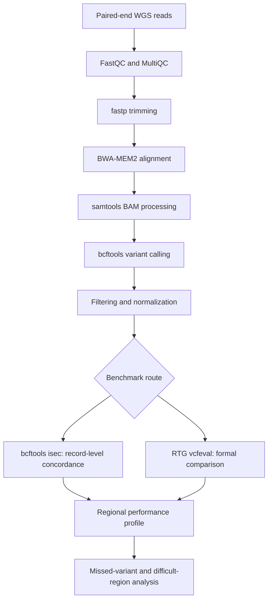

<div align="center">

# Benchmark-Aware WGS Variant Calling

### Regional validation with GIAB HG001, GRCh38 chromosome 22, `bcftools isec`, and RTG `vcfeval`

[](LICENSE)
[](environment.yml)
[](config/benchmark.yaml)
[](config/benchmark.yaml)
[](#reproducibility-status)
[](#scope-and-scientific-boundaries)

**A reproducible research framework for asking where a WGS small-variant workflow performs well, where it misses variants, and how the answer changes with the benchmarking method.**

[Why this study?](#why-this-study-exists) · [Workflow](#from-reads-to-evidence) · [Results](#headline-results) · [Quick start](#quick-start) · [Reproducibility](#reproducibility-status) · [Citation](#citation)

</div>

---

> **The idea behind this project:** a benchmark should do more than produce one accuracy score. It should reveal *which variants are missed, where the misses occur, and whether the evaluation method changes the conclusion*.

## Why this study exists

Variant-calling performance is often compressed into a single genome-wide metric. That is convenient, but it can hide local weaknesses and representation-dependent disagreements.

This repository investigates a narrower and more defensible question:

> **How consistently does a short-read WGS variant-calling workflow perform across selected GIAB HG001 high-confidence regions on GRCh38 chromosome 22, and what do the remaining errors reveal?**

The study expands the evaluation from **5 to 25 to 50 regions**, then compares direct normalized-record overlap with a formal, representation-aware benchmark.

## Study at a glance

| Component | Study setting |
|---|---|
| Benchmark genome | **GIAB HG001 / NA12878** |
| Truth-set release | **GIAB v4.2.1** |
| Reference | **GRCh38** |
| Evaluated scope | **Selected high-confidence chr22 regions** |
| Benchmark scales | **5, 25, and 50 regions** |
| Variant caller | `bcftools mpileup` + `bcftools call` |
| Call filters | `QUAL >= 30` and `DP >= 10` |
| Direct comparison | Normalized `bcftools isec` |
| Formal benchmark | RTG `vcfeval` |
| Error analyses | Missed variants, variant class, difficult-region overlap, low-recall regions, method discrepancies |

## From reads to evidence



The design deliberately separates **calling** from **evaluation**. The same callset can receive slightly different classifications when benchmark representations and matching logic differ.

## Headline results

### Performance across expanding regional scopes

| Benchmark scope | Truth variants | Shared variants | Missed | Extra | Recall | Precision | F1 |
|---|---:|---:|---:|---:|---:|---:|---:|
| 5 regions | 444 | 428 | 16 | 0 | **96.40%** | **100.00%** | **98.17%** |
| 25 regions | 1,504 | 1,421 | 83 | 0 | **94.48%** | **100.00%** | **97.16%** |
| 50 regions | 2,592 | 2,469 | 123 | 0 | **95.25%** | **100.00%** | **97.57%** |

These are progressively expanded validation scopes from the same benchmark sample. They are **not biological replicates** and should not be treated as independent experiments.

### Primary formal benchmark: 50 regions

| Method | TP / shared | FP | FN | Precision | Recall / sensitivity | F1 / F-measure |
|---|---:|---:|---:|---:|---:|---:|
| Normalized `bcftools isec` | 2,469 | 0 | 123 | **100.00%** | **95.25%** | **97.57%** |
| RTG `vcfeval` | 2,465 | 4 | 127 | **99.84%** | **95.10%** | **97.41%** |

RTG `vcfeval` is treated as the primary formal benchmark. It produced a slightly more conservative result than exact normalized-record comparison.

### The error signature matters more than the headline score

| Observation | Result | Interpretation |
|---|---:|---|
| Missed variants in the normalized 50-region comparison | **123** | Residual sensitivity gap |
| Missed deletions | **66** | Indel-associated error |
| Missed insertions | **56** | Indel-associated error |
| Missed SNVs | **1** | SNV recovery was comparatively strong in this scope |
| Misses overlapping annotated difficult regions | **77 / 123** | Substantial overlap; **not** a formal enrichment claim |
| Regions below the 92% recall threshold | **10** | Aggregate performance hides regional weakness |
| Regions where `isec` and `vcfeval` differed | **4 / 50** | Benchmarking logic can alter individual classifications |

**122 of the 123 normalized truth-only misses were indels.** That is the clearest optimization target produced by this analysis.

## Visual results

<table>
  <tr>
    <td width="50%" align="center">
      
      <br /><sub><b>Figure 1.</b> Performance across benchmark scales</sub>
    </td>
    <td width="50%" align="center">
      
      <br /><sub><b>Figure 2.</b> Normalized comparison versus formal benchmarking</sub>
    </td>
  </tr>
  <tr>
    <td width="50%" align="center">
      
      <br /><sub><b>Figure 3.</b> Missed-variant composition</sub>
    </td>
    <td width="50%" align="center">
      
      <br /><sub><b>Figure 4.</b> Regions below the configured recall threshold</sub>
    </td>
  </tr>
</table>

## Read the repository as a research record

You do not need to rerun the WGS analysis to inspect the evidence.

| Start here | What it contains |
|---|---|
| [`docs/experimental_design.md`](docs/experimental_design.md) | Study progression, endpoints, and interpretation |
| [`docs/results_summary.md`](docs/results_summary.md) | Consolidated numerical results |
| [`docs/error_analysis.md`](docs/error_analysis.md) | Indel, difficult-region, and method-discrepancy findings |
| [`docs/data_provenance.md`](docs/data_provenance.md) | Dataset identity and external-resource handling |
| [`docs/limitations.md`](docs/limitations.md) | Scientific and clinical boundaries |
| [`results/`](results/) | Compact CSVs, tables, and rendered figures |
| [`docs/lab_notebook/`](docs/lab_notebook/) | Chronological development record |

<details>
<summary><strong>Why do <code>bcftools isec</code> and RTG <code>vcfeval</code> disagree?</strong></summary>

`bcftools isec` compares normalized VCF records directly. RTG `vcfeval` performs a more representation-aware comparison between the baseline and calls. Equivalent biological variation can be encoded differently in VCF, so formal benchmarking may reclassify a small number of records even after normalization.

In this study, the aggregate difference was small but visible: RTG reported four fewer true positives, four additional false negatives, and four false positives.

</details>

<details>
<summary><strong>Does 100% precision mean the workflow is clinically accurate?</strong></summary>

No. The 100% value belongs to the normalized `bcftools isec` comparison within selected HG001 chr22 high-confidence regions. It is not a whole-genome estimate, a multi-sample validation, or evidence of clinical specificity. The formal RTG precision was 99.84% in the same regional scope.

</details>

<details>
<summary><strong>Why use 5, 25, and 50 regions?</strong></summary>

The expanding scopes test whether an encouraging result from a small evaluation remains stable when more benchmark variants and genomic contexts are included. The three scopes are not independent samples and are not used as biological replicates.

</details>

## Quick start

### 1. Clone and create the software environment

```bash
git clone https://github.com/Rita1791/Benchmark-aware-WGS-preventive-genomics.git
cd Benchmark-aware-WGS-preventive-genomics

conda env create -f environment.yml
conda activate benchmark-aware-wgs
```

### 2. Regenerate the committed core tables and figures

```bash
python scripts/19_create_publication_tables.py
python scripts/20_create_publication_figures.py
```

From the compact CSVs currently committed under `results/`, these scripts regenerate **Tables 1–3** and **Figures 1–3**. The region-level low-recall and discrepancy outputs require optional compact CSVs that are not currently committed.

### 3. Run the modular FASTQ-to-VCF workflow on your own data

Paired files must follow the naming pattern `SAMPLE_R1.fastq.gz` and `SAMPLE_R2.fastq.gz`.

```bash
RAW_DIR=/path/to/fastq bash pipeline/01_qc.sh

RAW_DIR=/path/to/fastq \
TRIM_DIR=/path/to/trimmed \
bash pipeline/02_trim.sh

REFERENCE=/path/to/GRCh38.fa \
TRIM_DIR=/path/to/trimmed \
BAM_DIR=/path/to/bam \
bash pipeline/03_align.sh

REFERENCE=/path/to/GRCh38.fa \
BAM_DIR=/path/to/bam \
VCF_DIR=/path/to/vcf \
REGION=chr22 \
bash pipeline/04_variant_calling.sh
```

The reference FASTA must be indexed for BWA-MEM2 and samtools before alignment and variant calling.

## External data required for full benchmarking

The repository intentionally does not provide a complete analysis-sized copy of the WGS alignment, GRCh38 reference, or GIAB benchmark resources. A full reconstruction needs:

- the matching **GRCh38 reference FASTA** and indexes;
- the **GIAB HG001 v4.2.1 GRCh38 small-variant truth VCF** and index;
- the corresponding **GIAB high-confidence BED**;
- HG001/NA12878 sequencing reads or the documented alignment resource;
- a sequence dictionary compatible with RTG `vcfeval`;
- enough storage and compute for BAM/VCF processing.

Authoritative starting points: [NIST Genome in a Bottle](https://www.nist.gov/programs-projects/genome-bottle), [`bcftools`](https://samtools.github.io/bcftools/), [RTG Tools](https://github.com/RealTimeGenomics/rtg-tools), and [BWA-MEM2](https://github.com/bwa-mem2/bwa-mem2).

## Repository map

| Path | Role |
|---|---|
| `config/benchmark.yaml` | Benchmark identity, thresholds, and analysis settings |
| `pipeline/` | Modular QC, trimming, alignment, and calling scripts |
| `scripts/` | Regional benchmarking, aggregation, comparison, tables, and figures |
| `docs/` | Methods, provenance, limitations, results, and lab notebook |
| `results/` | Compact metrics, selected intermediate records, tables, and figures |
| `reports/` | FastQC, fastp, and MultiQC reports |
| `manuscript/` | Draft manuscript material |
| `tests/` | Lightweight repository/configuration checks under development |

## Reproducibility status

| Task | Current status |
|---|---|
| Inspect committed headline metrics | ✅ Ready |
| Regenerate core tables and figures from compact CSVs | ✅ Ready |
| Run modular FASTQ → chr22 VCF processing with user-supplied data | 🟡 Requires external reference and input data |
| Recreate the complete 50-region `isec` + RTG study from a clean clone | 🟡 Partially documented; local resources and manual path preparation are still required |
| Verify exact historical tool versions and input checksums | 🟡 Not yet complete |
| Use as a clinical diagnostic workflow | ❌ Not validated |

### Known gaps

- The repository does not yet provide a single portable workflow engine such as Snakemake or Nextflow for the complete benchmark.
- Several development scripts retain assumptions about local paths and should be reviewed before execution.
- Exact software versions remain marked `TBD` in [`docs/software_versions.md`](docs/software_versions.md).
- Source URLs, download dates, and checksums are not complete for every external input.
- Optional compact region-level CSVs are absent, while some pre-rendered regional figures and Markdown table shells remain in the repository.
- The current tests cover repository structure and configuration rather than biological correctness or full end-to-end execution; the harness needs cleanup before a passing-test badge would be justified.

## Scope and scientific boundaries

This repository is a **regional analytical-validation study**. It is not:

- a whole-genome performance claim;
- a clinical diagnostic pipeline;
- a disease-risk or pathogenicity interpretation engine;
- a preventive-health recommendation system;
- evidence of clinical sensitivity or clinical specificity.

The term *preventive genomics* describes the longer-term application context. The implemented work here stops at variant-calling validation and benchmark-focused error analysis.

## Roadmap

- [ ] Pin every software version and record input checksums.
- [ ] Replace local path assumptions with a single configuration-driven workflow.
- [ ] Add an end-to-end Snakemake or Nextflow implementation.
- [ ] Commit reproducible region definitions and compact region-level result files.
- [ ] Add CI for syntax, configuration, and small fixture-based execution.
- [ ] Compare additional small-variant callers.
- [ ] Expand from chr22 regions to broader GIAB whole-genome benchmarking.
- [ ] Validate on additional GIAB samples and independent sequencing datasets.
- [ ] Add stratified analysis for difficult genomic contexts and variant classes.

## Contributors

**Ritika Rajendra Rawat** — Project lead; study design, workflow development, benchmarking strategy, analysis, interpretation, visualization, documentation, and research output.

**Farheena Azim Faridi** — Computational workflow support, benchmarking assistance, testing, refinement, and documentation.

Developed within the research and computational environment of **Nainsense Labs Private Limited**. See [`CONTRIBUTORS.md`](CONTRIBUTORS.md) for detailed contribution statements.

## Citation

If you use the repository, workflow, or derived analysis, cite the software metadata provided in [`CITATION.cff`](CITATION.cff):

> Rawat, R. R. (2026). *Benchmark-aware regional validation of a reproducible WGS variant-calling workflow using GIAB HG001 chr22 reference regions* [Software].

GitHub also exposes a **Cite this repository** option from the repository sidebar when `CITATION.cff` is present.

## License

Released under the [MIT License](LICENSE).

---

<div align="center">

**The headline is high accuracy. The useful finding is where accuracy breaks.**

</div>
