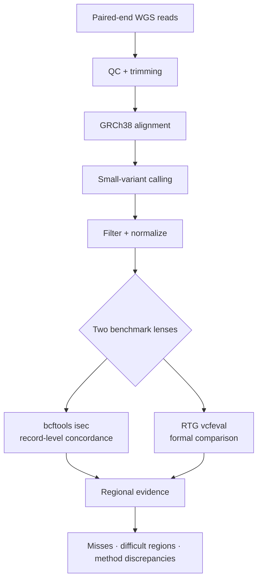
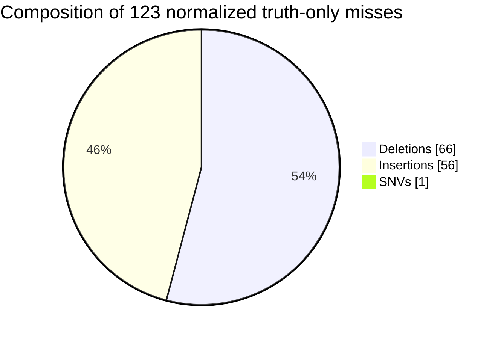
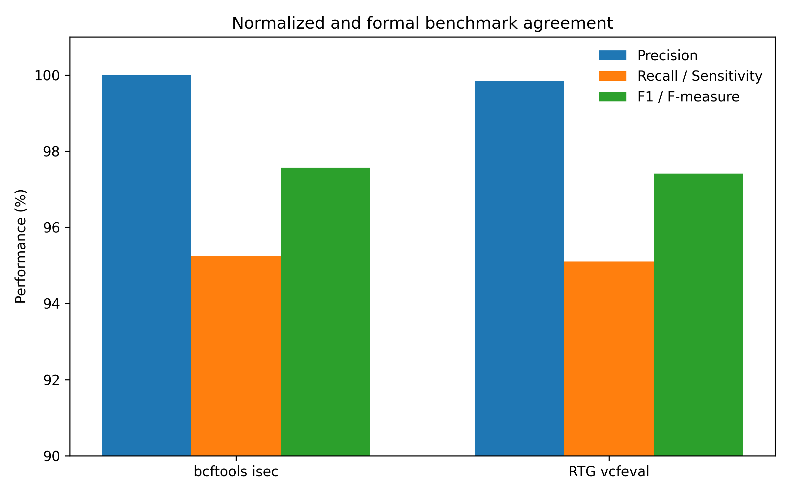
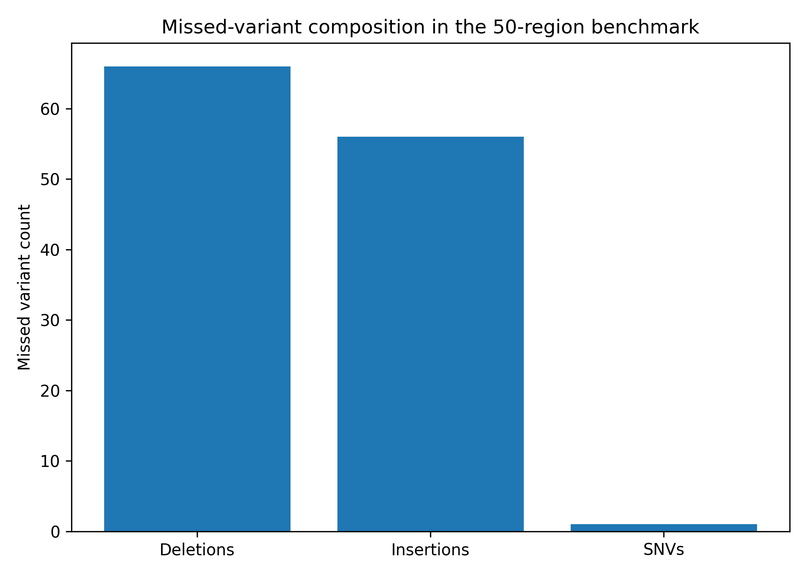
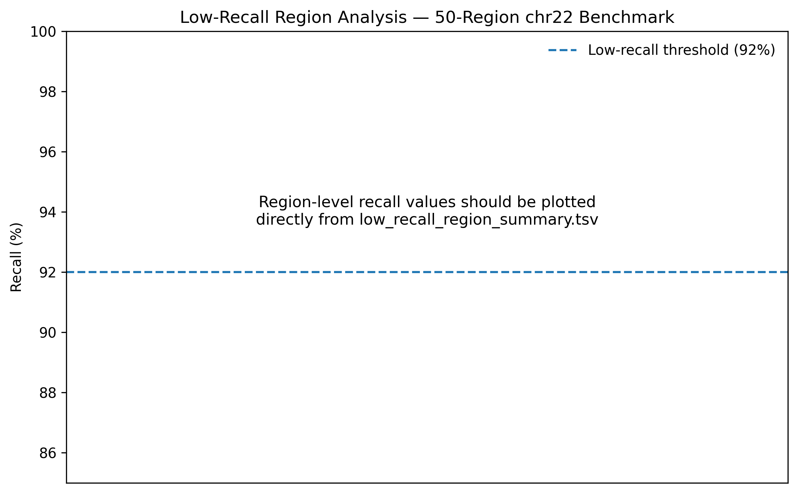

<div align="center">

# 🧬 Benchmark-Aware WGS

### A regional GIAB study of where small-variant calling succeeds—and where it breaks

<p>
  <strong>HG001 / NA12878</strong> · <strong>GRCh38 chr22</strong> · <strong>5 → 25 → 50 regions</strong><br>
  <code>bcftools isec</code> + RTG <code>vcfeval</code> + regional error analysis
</p>

[](LICENSE)
[](environment.yml)
[](config/benchmark.yaml)
[](config/benchmark.yaml)
[](#reproducibility-dashboard)
[](#what-this-project-does--and-does-not-prove)

<br>

**The headline is high accuracy. The useful finding is where accuracy breaks.**

<br>

[🎯 Research question](#the-question) · [🧪 Workflow](#the-experiment-in-one-view) · [📊 Results](#the-result-in-60-seconds) · [🚀 Run it](#quick-start) · [🧭 Project map](#choose-your-route) · [⚠️ Boundaries](#what-this-project-does--and-does-not-prove)

</div>

---

> [!IMPORTANT]
> This repository is a **regional analytical-validation study**, not a clinical genomics product. It evaluates a short-read small-variant workflow within selected GIAB HG001 high-confidence regions on chromosome 22.

## The question

Most variant-calling benchmarks end with a single score. That score is useful—but incomplete.

This project asks a stricter question:

> **When a WGS small-variant workflow performs well overall, which variants are still missed, where do those misses occur, and does the benchmarking method change the conclusion?**

To challenge the first result instead of trusting it, the benchmark was expanded in stages:

<div align="center">

### `5 regions` → `25 regions` → `50 regions`

**small validation** → **broader challenge** → **primary regional analysis**

</div>

The three scopes are progressive expansions of the same benchmark sample. They are **not independent biological replicates**.

## The result in 60 seconds

<table>
  <tr>
    <td align="center" width="25%"><strong>2,592</strong><br><sub>truth variants<br>in 50 regions</sub></td>
    <td align="center" width="25%"><strong>95.25%</strong><br><sub>normalized<br>recall</sub></td>
    <td align="center" width="25%"><strong>97.57%</strong><br><sub>normalized<br>F1 score</sub></td>
    <td align="center" width="25%"><strong>122 / 123</strong><br><sub>missed variants<br>were indels</sub></td>
  </tr>
</table>

The workflow recovered most truth variants in the selected regions. But the remaining error was highly structured:

- **66 deletions** were missed.
- **56 insertions** were missed.
- Only **1 missed variant** was an SNV.
- **77 of 123 misses** overlapped annotated difficult regions.
- **10 regions** fell below the configured 92% recall threshold.
- `bcftools isec` and RTG `vcfeval` differed in **4 of 50 regions**.

> [!TIP]
> **The optimization target is not “variant calling” in general. It is indel sensitivity in difficult local contexts.**

## The experiment in one view



<details>
<summary><strong>🔬 Open the full method in plain language</strong></summary>

1. Inspect paired-end reads with **FastQC** and **MultiQC**.
2. Trim and clean the reads with **fastp**.
3. Align reads to **GRCh38** with **BWA-MEM2**.
4. Process the BAM files with **samtools**.
5. Call small variants using `bcftools mpileup` + `bcftools call`.
6. Apply `QUAL >= 30` and `DP >= 10` filters.
7. Normalize the truth and query VCFs.
8. Compare records directly with `bcftools isec`.
9. Benchmark formally with RTG `vcfeval`.
10. Investigate missed variants by class, region, difficult-context overlap, and method disagreement.

</details>

## Benchmark design

| Component | Study setting |
|---|---|
| Benchmark genome | **GIAB HG001 / NA12878** |
| Truth-set release | **GIAB v4.2.1** |
| Reference assembly | **GRCh38** |
| Evaluated scope | **Selected high-confidence chromosome 22 regions** |
| Regional scales | **5, 25, and 50 regions** |
| Variant caller | `bcftools mpileup` + `bcftools call` |
| Call filters | `QUAL >= 30`; `DP >= 10` |
| Normalized comparison | `bcftools isec` |
| Formal benchmark | RTG `vcfeval` |
| Error lenses | Variant class, difficult-region overlap, low-recall regions, method discrepancies |

## Performance under increasing benchmark scope

| Scope | Truth | Shared | Missed | Extra | Recall | Precision | F1 |
|---:|---:|---:|---:|---:|---:|---:|---:|
| **5 regions** | 444 | 428 | 16 | 0 | **96.40%** | **100.00%** | **98.17%** |
| **25 regions** | 1,504 | 1,421 | 83 | 0 | **94.48%** | **100.00%** | **97.16%** |
| **50 regions** | 2,592 | 2,469 | 123 | 0 | **95.25%** | **100.00%** | **97.57%** |

### Two tools, two matching philosophies

| 50-region benchmark | TP / shared | FP | FN | Precision | Recall | F1 |
|---|---:|---:|---:|---:|---:|---:|
| Normalized `bcftools isec` | 2,469 | 0 | 123 | **100.00%** | **95.25%** | **97.57%** |
| RTG `vcfeval` | 2,465 | 4 | 127 | **99.84%** | **95.10%** | **97.41%** |

RTG `vcfeval` is treated as the **primary formal benchmark**. Its result was slightly more conservative than the normalized record-level comparison.

<details>
<summary><strong>🤔 Why can the tools disagree after normalization?</strong></summary>

`bcftools isec` compares normalized VCF records directly. RTG `vcfeval` performs a more representation-aware comparison between the truth set and calls. Equivalent biological variation can still be encoded differently in VCF, so the matching strategy can reclassify a small number of records.

Here, RTG reported four fewer true positives, four additional false negatives, and four false positives.

</details>

## The error fingerprint



| Signal | What was observed | What can be concluded |
|---|---:|---|
| Truth-only misses | **123** | A residual sensitivity gap remains |
| Missed indels | **122 / 123** | The error is overwhelmingly indel-associated |
| Difficult-region overlap | **77 / 123** | Many misses occur in difficult contexts; this is **not** a formal enrichment test |
| Low-recall regions | **10** | Aggregate metrics hide local weaknesses |
| Method-discrepant regions | **4 / 50** | Benchmark logic affects some classifications |

## Visual evidence

<table>
  <tr>
    <td width="50%" align="center">
      
      <br><sub><strong>Figure 1.</strong> Performance across expanding benchmark scopes</sub>
    </td>
    <td width="50%" align="center">
      
      <br><sub><strong>Figure 2.</strong> Record-level comparison versus formal benchmarking</sub>
    </td>
  </tr>
  <tr>
    <td width="50%" align="center">
      
      <br><sub><strong>Figure 3.</strong> Missed-variant composition</sub>
    </td>
    <td width="50%" align="center">
      
      <br><sub><strong>Figure 4.</strong> Regions below the configured recall threshold</sub>
    </td>
  </tr>
</table>

## Choose your route

| If you are a… | Start here | You will find… |
|---|---|---|
| **Research reader** | [`docs/results_summary.md`](docs/results_summary.md) | Consolidated findings and headline metrics |
| **Reviewer** | [`docs/experimental_design.md`](docs/experimental_design.md) | Study progression, endpoints, and interpretation |
| **Reproducibility auditor** | [`docs/data_provenance.md`](docs/data_provenance.md) | Dataset identity and external-resource handling |
| **Variant-analysis researcher** | [`docs/error_analysis.md`](docs/error_analysis.md) | Indel misses, difficult regions, and method discrepancies |
| **Critical reader** | [`docs/limitations.md`](docs/limitations.md) | Scientific and clinical boundaries |
| **Developer** | [`pipeline/`](pipeline/) and [`scripts/`](scripts/) | Modular processing and analysis code |
| **Project historian** | [`docs/lab_notebook/`](docs/lab_notebook/) | Chronological research and development record |

## Quick start

### 1. Clone the repository

```bash
git clone https://github.com/Rita1791/Benchmark-aware-WGS-preventive-genomics.git
cd Benchmark-aware-WGS-preventive-genomics
```

### 2. Create the environment

```bash
conda env create -f environment.yml
conda activate benchmark-aware-wgs
```

### 3. Regenerate committed tables and figures

```bash
python scripts/19_create_publication_tables.py
python scripts/20_create_publication_figures.py
```

These scripts regenerate **Tables 1–3** and **Figures 1–3** from the compact CSVs currently committed under `results/`. Region-level low-recall and discrepancy outputs require optional compact CSVs that are not currently committed.

### 4. Run the modular FASTQ → VCF workflow on your own data

Input files must follow the naming convention `SAMPLE_R1.fastq.gz` and `SAMPLE_R2.fastq.gz`.

```bash
RAW_DIR=/path/to/fastq \
bash pipeline/01_qc.sh

RAW_DIR=/path/to/fastq \
TRIM_DIR=/path/to/trimmed \
bash pipeline/02_trim.sh

REFERENCE=/path/to/GRCh38.fa \
TRIM_DIR=/path/to/trimmed \
BAM_DIR=/path/to/bam \
bash pipeline/03_align.sh

REFERENCE=/path/to/GRCh38.fa \
BAM_DIR=/path/to/bam \
VCF_DIR=/path/to/vcf \
REGION=chr22 \
bash pipeline/04_variant_calling.sh
```

> [!NOTE]
> The reference FASTA must be indexed for BWA-MEM2 and samtools before alignment and variant calling.

## External resources required for full benchmarking

Large genomic inputs are intentionally not bundled with this repository. A full reconstruction requires:

- the matching **GRCh38 reference FASTA** and indexes;
- the **GIAB HG001 v4.2.1 GRCh38 small-variant truth VCF** and index;
- the corresponding **GIAB high-confidence BED**;
- HG001/NA12878 sequencing reads or the documented alignment resource;
- an RTG-compatible sequence dictionary;
- sufficient compute and storage for BAM/VCF processing.

Authoritative starting points:

- [NIST Genome in a Bottle](https://www.nist.gov/programs-projects/genome-bottle)
- [`bcftools`](https://samtools.github.io/bcftools/)
- [RTG Tools](https://github.com/RealTimeGenomics/rtg-tools)
- [BWA-MEM2](https://github.com/bwa-mem2/bwa-mem2)

## Repository anatomy

```text
Benchmark-aware-WGS-preventive-genomics/
├── config/       # Benchmark identity, thresholds and settings
├── pipeline/     # QC, trimming, alignment and variant calling
├── scripts/      # Benchmarking, aggregation, analysis and figures
├── docs/         # Methods, provenance, limitations and lab notebook
├── results/      # Compact metrics, tables and rendered figures
├── reports/      # FastQC, fastp and MultiQC reports
├── manuscript/   # Draft research material
└── tests/        # Lightweight checks under development
```

## Reproducibility dashboard

| Capability | Status | Honest interpretation |
|---|:---:|---|
| Inspect committed headline metrics | ✅ | Ready |
| Rebuild core tables and Figures 1–3 | ✅ | Ready from committed compact CSVs |
| Run modular FASTQ → chr22 VCF processing | 🟡 | Requires user-supplied data and reference files |
| Recreate the complete 50-region `isec` + RTG study from a clean clone | 🟡 | Partially documented; local resources and manual path preparation remain |
| Verify exact historical versions and all input checksums | 🟡 | Not yet complete |
| Use for clinical diagnosis | ❌ | Not validated |

<details>
<summary><strong>🧱 Known technical gaps</strong></summary>

- No single portable Snakemake or Nextflow workflow yet covers the complete benchmark.
- Several development scripts still assume local paths and require review before execution.
- Exact software versions remain marked `TBD` in [`docs/software_versions.md`](docs/software_versions.md).
- URLs, download dates, and checksums are incomplete for some external inputs.
- Some optional region-level compact CSVs are absent.
- Current tests check repository structure and configuration—not biological correctness or full end-to-end execution.

</details>

## What this project does—and does not prove

| ✅ Supported by this repository | ❌ Not supported by this repository |
|---|---|
| Regional analytical validation | Whole-genome performance claims |
| Evaluation within selected GIAB HG001 chr22 high-confidence regions | Multi-sample clinical validation |
| Comparison of normalized `isec` and RTG `vcfeval` results | Clinical sensitivity or specificity |
| Error analysis by variant class and regional context | Pathogenicity or disease-risk interpretation |
| A research foundation for broader benchmarking | Preventive-health or treatment recommendations |

The phrase **preventive genomics** describes the longer-term application context. The implementation currently stops at variant-calling validation and benchmark-focused error analysis.

## Frequently asked questions

<details>
<summary><strong>Does 100% precision mean the pipeline is clinically accurate?</strong></summary>

No. That value comes from normalized `bcftools isec` comparison inside selected HG001 chromosome 22 high-confidence regions. It is not a whole-genome, multi-sample, or clinical estimate. RTG precision was 99.84% in the same regional scope.

</details>

<details>
<summary><strong>Why benchmark at 5, 25, and 50 regions?</strong></summary>

The staged design tests whether an encouraging result from a small scope remains stable when more variants and genomic contexts are added. The scopes are nested evaluation stages, not biological replicates.

</details>

<details>
<summary><strong>Can I run the full study with one command?</strong></summary>

Not yet. Core tables and figures can be regenerated, and the FASTQ-to-VCF stages are modular. However, a clean-clone reconstruction of the full 50-region benchmark still needs external resources, local path preparation, and some manual orchestration.

</details>

<details>
<summary><strong>Why are large genomic files missing?</strong></summary>

Reference genomes, truth resources, and WGS alignments are large and externally governed. The repository preserves compact evidence and documentation while directing users to authoritative sources for the underlying datasets.

</details>

## Roadmap

- [ ] Pin every software version and record input checksums.
- [ ] Replace local path assumptions with configuration-driven execution.
- [ ] Add a complete Snakemake or Nextflow workflow.
- [ ] Commit reproducible region definitions and compact region-level outputs.
- [ ] Add CI for syntax, configuration, and fixture-based execution.
- [ ] Compare additional small-variant callers.
- [ ] Expand beyond selected chr22 regions.
- [ ] Validate on additional GIAB samples and independent datasets.
- [ ] Add stratified analysis for difficult contexts and variant classes.

## Contributors

**Ritika Rajendra Rawat**  
Project lead · Study design · Workflow development · Benchmarking strategy · Analysis · Interpretation · Visualization · Documentation

**Farheena Azim Faridi**  
Workflow support · Benchmarking assistance · Testing · Refinement · Documentation

Developed within the research and computational environment of **Nainsense Labs Private Limited**. See [`CONTRIBUTORS.md`](CONTRIBUTORS.md) for detailed contribution statements.

## Citation

If you use this repository, workflow, or derived analysis, cite the metadata in [`CITATION.cff`](CITATION.cff):

> Rawat, R. R. (2026). *Benchmark-aware regional validation of a reproducible WGS variant-calling workflow using GIAB HG001 chr22 reference regions* [Software].

GitHub will expose **Cite this repository** when `CITATION.cff` is present.

## License

Released under the [MIT License](LICENSE).

---

<div align="center">

### 🧬 High accuracy is the beginning of the investigation—not the end.

<sub>Built to turn a benchmark score into an evidence trail.</sub>

</div>
