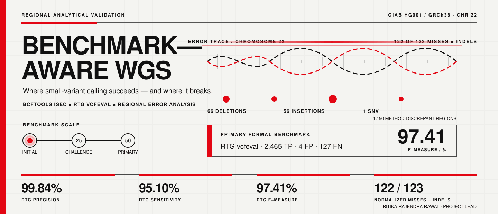
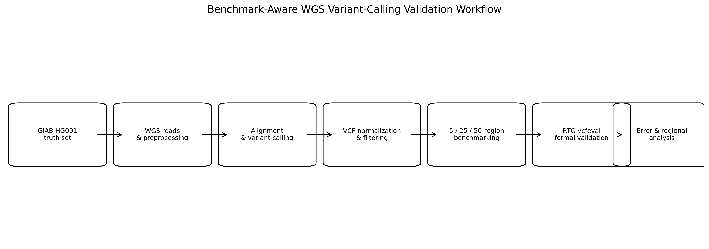

<div align="center">

# Benchmark-Aware WGS Variant Calling

### Regional validation of a small-variant workflow using GIAB HG001

**Ritika Rajendra Rawat** · **Farheena Azim Faridi**

`Whole-Genome Sequencing` · `Variant Calling` · `GIAB Benchmarking` · `Error Analysis` · `Reproducible Bioinformatics`

<br>

<a href="assets/README_Hero_Benchmark_Aware_WGS.gif">
  
</a>

<br>

[Results](#what-i-found) ·
[Experimental design](#experimental-design) ·
[Figures](#visual-results) ·
[Reproducibility](#reproducing-the-work) ·
[Limitations](#where-i-would-be-careful) ·
[Research notes](#what-i-learned-from-this-project)

</div>

---

# Why I built this

This project started from a problem I kept noticing while working with genomic pipelines:

> **A variant-calling workflow can have a very good overall benchmark score and still fail systematically at exactly the kinds of variants or genomic regions that deserve more attention.**

So I did not want this repository to end with:

```text
Precision = X
Recall = Y
F1 = Z
```

I wanted to know what was hiding behind those numbers.

More specifically:

- Which variants were missed?
- Were the errors mostly SNVs or indels?
- Did performance remain similar when I expanded the benchmark?
- Were some genomic regions consistently weaker?
- Would two benchmarking approaches classify the same calls in exactly the same way?
- And, most importantly, what should actually be improved after looking at the errors?

That is why I call the project **benchmark-aware** rather than simply a WGS pipeline.

The workflow itself matters, but the main research question is about **how to evaluate the workflow properly**.

---

# The question

The central question I tested was:

> **When a short-read WGS small-variant workflow performs well overall, where does it still fail, and does the answer change when the benchmarking method or evaluation scope changes?**

I used the Genome in a Bottle **HG001 / NA12878** benchmark and focused on selected high-confidence regions from **GRCh38 chromosome 22**.

The study was deliberately expanded in stages:

```text
5 regions
    ↓
25 regions
    ↓
50 regions
```

I did this because I did not want the result from a small set of regions to become the conclusion before it had been challenged on a broader set.

These are **progressively expanded scopes from the same benchmark sample**, not biological replicates.

---

# What I actually evaluated

| Component | Study setting |
|---|---|
| Benchmark sample | **GIAB HG001 / NA12878** |
| Truth set | **GIAB v4.2.1** |
| Reference | **GRCh38** |
| Chromosome | **chr22** |
| Evaluation type | **Regional high-confidence benchmarking** |
| Benchmark stages | **5, 25 and 50 regions** |
| Variant caller | **bcftools mpileup + bcftools call** |
| Calling model | **Multiallelic** |
| Minimum QUAL | **30** |
| Minimum DP | **10** |
| VCF normalization | **bcftools norm** |
| Record comparison | **bcftools isec** |
| Formal benchmark | **RTG vcfeval** |
| Low-recall threshold | **92%** |

The canonical configuration is stored in:

[`config/benchmark.yaml`](config/benchmark.yaml)

---

# The workflow

The computational path is fairly conventional.

The part I wanted to make less conventional was what happened **after variant calling**.

```text
Paired-end sequencing data
          │
          ▼
      FastQC
          │
          ▼
        fastp
          │
          ▼
     BWA-MEM2
          │
          ▼
      samtools
          │
          ▼
 bcftools mpileup/call
          │
          ▼
      filtering
   QUAL ≥ 30 · DP ≥ 10
          │
          ▼
  VCF normalization
          │
     ┌────┴────┐
     │         │
     ▼         ▼
bcftools     RTG
  isec      vcfeval
     │         │
     └────┬────┘
          ▼
   Error analysis
          │
   ┌──────┼─────────┐
   ▼      ▼         ▼
variant  regional  benchmark-
 class   context   method
 errors  errors    differences
```

<p align="center">
  <a href="results/publication_ready/figures/figure_5_workflow_overview.png">
    
  </a>
</p>

---

# What I found

## 1. The workflow performed well — but the benchmark scale mattered

The normalized `bcftools isec` comparison produced:

| Scope | Truth | Shared | Missed | Extra | Recall | Precision | F1 |
|---|---:|---:|---:|---:|---:|---:|---:|
| **5 regions** | 444 | 428 | 16 | 0 | **96.40%** | **100.00%** | **98.17%** |
| **25 regions** | 1,504 | 1,421 | 83 | 0 | **94.48%** | **100.00%** | **97.16%** |
| **50 regions** | 2,592 | 2,469 | 123 | 0 | **95.25%** | **100.00%** | **97.57%** |

The source table is:

[`results/benchmark_metrics.csv`](results/benchmark_metrics.csv)

What I take from this is not that one of these three numbers is the "correct" performance.

The useful observation is that expanding the benchmark changed the measured recall.

The 5-region result looked extremely strong.

Once I expanded the evaluation, more failure modes became visible.

That was exactly why I kept increasing the scope rather than stopping at the first benchmark.

<p align="center">
  <a href="results/publication_ready/figures/figure_1_benchmark_scale_performance.png">
    
  </a>
</p>

---

# 2. The formal benchmark was slightly more conservative

For the final 50-region evaluation, I also ran **RTG `vcfeval`**.

The result was:

```text
True positives      2,465
False positives         4
False negatives       127

Precision           99.84%
Sensitivity         95.10%
F-measure           97.41%
```

The corresponding normalized `bcftools isec` result was:

```text
Shared variants     2,469
Extra variants          0
Missed variants       123

Precision          100.00%
Recall              95.25%
F1                  97.57%
```

The comparison is stored in:

[`results/final_summary.csv`](results/final_summary.csv)

These results are very similar.

But they are **not identical**.

That difference is one of the reasons I kept both methods in the project.

<p align="center">
  <a href="results/publication_ready/figures/figure_2_bcftools_vs_rtg_vcfeval.png">
    
  </a>
</p>

---

## Why do `bcftools isec` and RTG `vcfeval` disagree?

This was one of the more useful parts of the project for me.

At first glance, it is tempting to think that after normalization, two benchmark methods should produce exactly the same result.

But they are asking the matching question differently.

### `bcftools isec`

I use this as a normalized **record-level concordance comparison**.

### RTG `vcfeval`

I use this as the primary **representation-aware formal benchmark**.

Different VCF representations can describe biologically related variation in ways that are not always matched identically by a direct record comparison.

In this dataset, RTG classified:

```text
4 fewer true positives
4 additional false negatives
4 false positives
```

compared with the normalized record-level comparison.

So one lesson from the project was:

> **The benchmarking method is part of the experiment. It should not be treated as an invisible final command.**

---

# 3. The main error pattern was indel detection

This became the most important result for me.

The normalized 50-region comparison contained:

```text
123 truth-only missed variants
```

When I classified those misses:

| Variant class | Missed |
|---|---:|
| **Deletion** | **66** |
| **Insertion** | **56** |
| **SNV** | **1** |
| **Total** | **123** |

So:

```text
122 / 123 missed variants were indels
```

The source is:

[`results/variant_class_summary.csv`](results/variant_class_summary.csv)

<p align="center">
  <a href="results/publication_ready/figures/figure_3_missed_variant_type_distribution.png">
    
  </a>
</p>

This changed how I viewed the benchmark.

A summary such as:

```text
F1 = 97.57%
```

sounds like the pipeline is simply "very accurate."

But looking at the 123 misses tells a much more useful story:

> **The remaining error is highly asymmetric. The workflow's primary weakness in this regional benchmark is indel sensitivity rather than a broad inability to detect small variants.**

For pipeline development, that is much more actionable than the F1 score alone.

---

# 4. Difficult genomic contexts also mattered

The analysis documentation records:

```text
77 / 123 missed variants
```

with difficult-region annotations.

That corresponds to substantial overlap between observed errors and difficult genomic contexts.

However, I want to keep the interpretation narrow.

I did **not** perform a formal enrichment test against an appropriate genomic background.

Therefore I describe this as:

> **descriptive overlap**

rather than:

> **statistical enrichment**

That distinction matters.

It would be easy to write that difficult regions "significantly caused" the errors.

The current analysis does not establish that.

---

# 5. Aggregate performance hid weaker regions

Using a recall threshold of:

```text
92%
```

the analysis documentation identified:

```text
10 low-recall regions
```

Together, these regions contained:

```text
56 missed variants
31 deletions
24 insertions
1 SNV
```

and 32 of those missed variants were documented as overlapping difficult-region annotations.

This is another reason I do not think a single genome-wide or chromosome-wide score is enough.

A caller can perform very well overall while a smaller number of local regions carry a disproportionate amount of the remaining error.

---

# 6. Four regions changed interpretation depending on benchmark method

The documented discrepancy analysis identified four regions:

```text
region_14
region_20
region_30
region_40
```

where `bcftools isec` and RTG `vcfeval` did not give completely identical classifications.

This does not mean one tool is "wrong."

It shows that:

> **benchmark representation and matching logic can affect local conclusions even when aggregate performance is almost identical.**

That became one of the central ideas behind the term **benchmark-aware** for this project.

---

# The result in one picture

For me, the study can be reduced to this:

```text
                     HIGH OVERALL PERFORMANCE
                              │
                              ▼
                     ~95% sensitivity/recall
                              │
                              ▼
                  But where are the failures?
                              │
             ┌────────────────┼────────────────┐
             │                │                │
             ▼                ▼                ▼
           INDELS        DIFFICULT          REGIONAL
        122 / 123         CONTEXTS          VARIATION
             │                │                │
             └────────────────┼────────────────┘
                              ▼
                 Benchmark method also matters
                              │
                              ▼
                  Pipeline optimization target
```

The score is the beginning of the analysis, not the end.

---

# Experimental design

The benchmark was structured as a progression rather than one final run.

### Stage 1 — 5 regions

This was the smaller initial regional evaluation:

```text
444 truth variants
428 shared
16 missed
0 extra
```

### Stage 2 — 25 regions

I expanded the benchmark to test whether the initial performance persisted:

```text
1,504 truth variants
1,421 shared
83 missed
0 extra
```

### Stage 3 — 50 regions

The final regional scope contained:

```text
2,592 truth variants
2,469 shared
123 missed
0 extra
```

The 50-region analysis is the principal regional comparison because it contains the broadest evaluated set of truth variants and contexts among these three configurations.

The formal RTG benchmark was then used on this final scope.

More detail is available in:

[`docs/experimental_design.md`](docs/experimental_design.md)

---

# How regions were selected

The current benchmark configuration records a deterministic selection strategy based on **variant-rich GIAB high-confidence regions**.

Configured criteria include:

```text
minimum region length     5,000 bp
maximum region length    25,000 bp
minimum truth variants       20
```

The 5-, 25-, and 50-region sets therefore represent progressive benchmark expansions.

They are not randomly sampled independent groups.

That means I do not use them as biological replicates or as independent statistical observations.

---

# Why this matters for preventive genomics

The repository name includes **preventive genomics**, but I want to be precise about where this implementation currently stops.

The current project does **not** perform:

```text
variant pathogenicity interpretation
polygenic risk scoring
disease-risk prediction
pharmacogenomic interpretation
clinical decision support
preventive-health recommendation
```

The connection to preventive genomics is upstream.

Before a genomic variant can be interpreted for any downstream application, I want confidence that the analytical workflow is able to detect the variant reliably and that its known failure modes are understood.

So the current scope is:

```text
sequencing
    ↓
variant calling
    ↓
benchmarking
    ↓
error characterization
    ↓
analytical confidence
```

and **not yet**:

```text
analytical confidence
    ↓
clinical interpretation
```

That boundary is intentional.

---

# Visual results

<table>
<tr>

<td width="50%" align="center">

<a href="results/publication_ready/figures/figure_1_benchmark_scale_performance.png">

</a>

**Benchmark scale**

How recall, precision and F1 changed from 5 to 50 regions.

</td>

<td width="50%" align="center">

<a href="results/publication_ready/figures/figure_2_bcftools_vs_rtg_vcfeval.png">

</a>

**Two benchmark lenses**

Normalized record comparison versus RTG formal benchmarking.

</td>

</tr>

<tr>

<td width="50%" align="center">

<a href="results/publication_ready/figures/figure_3_missed_variant_type_distribution.png">

</a>

**Failure composition**

The remaining normalized errors were overwhelmingly indels.

</td>

<td width="50%" align="center">

<a href="results/publication_ready/figures/figure_5_workflow_overview.png">

</a>

**Workflow**

From sequencing data to benchmark-aware error analysis.

</td>

</tr>
</table>

---

# One figure I deliberately do not use as evidence

The repository contains:

```text
results/publication_ready/figures/figure_4_low_recall_regions.png
```

but the compact source file required to regenerate that figure is not currently committed.

For that reason, I do **not** present Figure 4 above as independently reproducible evidence.

The low-recall findings remain documented in the analysis notes, but I prefer to make the missing reconstruction path visible rather than give the figure the same status as Figures 1–3.

This is one of the repository issues I would clean up in the next revision.

---

# Where the evidence lives

If I were reviewing this repository, I would start with these files:

| Question | File |
|---|---|
| What were the 5/25/50-region results? | [`results/benchmark_metrics.csv`](results/benchmark_metrics.csv) |
| What did RTG report? | [`results/final_summary.csv`](results/final_summary.csv) |
| Which variant types were missed? | [`results/variant_class_summary.csv`](results/variant_class_summary.csv) |
| What was the experimental design? | [`docs/experimental_design.md`](docs/experimental_design.md) |
| How are the results interpreted? | [`docs/results_summary.md`](docs/results_summary.md) |
| What are the limitations? | [`docs/limitations.md`](docs/limitations.md) |
| What configuration was used? | [`config/benchmark.yaml`](config/benchmark.yaml) |
| Where is the FASTQ → VCF workflow? | [`pipeline/`](pipeline/) |
| Where is the benchmarking analysis? | [`scripts/`](scripts/) |
| Where are publication-ready outputs? | [`results/publication_ready/`](results/publication_ready/) |
| Who contributed what? | [`CONTRIBUTORS.md`](CONTRIBUTORS.md) |

---

# Pipeline implementation

The cleaner modular processing workflow is under:

[`pipeline/`](pipeline/)

```text
pipeline/
├── 01_qc.sh
├── 02_trim.sh
├── 03_align.sh
├── 04_variant_calling.sh
└── 05_real_trim.sh
```

The main stages are:

### `01_qc.sh`

Initial FASTQ quality assessment.

### `02_trim.sh`

Read preprocessing and trimming.

### `03_align.sh`

Alignment to the configured reference using BWA-MEM2 and BAM processing.

### `04_variant_calling.sh`

Small-variant calling and filtering.

The `scripts/` directory contains the historical and analytical work used while expanding the study, including chromosome 22 test runs, subsampling, 5/25/50-region benchmark development, error analysis, low-recall analysis, and publication-output generation.

I have kept those intermediate scripts because they show how the analysis actually developed rather than presenting only one polished final command.

---

# Reproducing the work

## 1. Clone the repository

```bash
git clone https://github.com/Rita1791/Benchmark-aware-WGS-preventive-genomics.git
cd Benchmark-aware-WGS-preventive-genomics
```

---

## 2. Create the environment

```bash
conda env create -f environment.yml
conda activate benchmark-aware-wgs
```

The environment includes:

```text
Python 3.11

FastQC
MultiQC
fastp

BWA-MEM2

samtools
bcftools
htslib

RTG Tools

pandas
NumPy
Matplotlib
PyYAML
```

---

## 3. Rebuild the compact publication evidence

The committed compact CSV files are sufficient to regenerate the principal tables and Figures 1–3.

```bash
python scripts/19_create_publication_tables.py
python scripts/20_create_publication_figures.py
```

---

## 4. Run the modular sequencing workflow

Quality control:

```bash
RAW_DIR=/path/to/fastq \
bash pipeline/01_qc.sh
```

Trimming:

```bash
RAW_DIR=/path/to/fastq \
TRIM_DIR=/path/to/trimmed \
bash pipeline/02_trim.sh
```

Alignment:

```bash
REFERENCE=/path/to/GRCh38.fa \
TRIM_DIR=/path/to/trimmed \
BAM_DIR=/path/to/bam \
bash pipeline/03_align.sh
```

Variant calling:

```bash
REFERENCE=/path/to/GRCh38.fa \
BAM_DIR=/path/to/bam \
VCF_DIR=/path/to/vcf \
REGION=chr22 \
bash pipeline/04_variant_calling.sh
```

---

# What is required for the complete benchmark

The complete study cannot be recreated from the GitHub repository alone because the large external biological resources are not committed.

A full reconstruction requires:

```text
GRCh38 reference FASTA + indexes

GIAB HG001 v4.2.1 GRCh38 truth VCF

GIAB HG001 high-confidence BED

HG001 / NA12878 sequencing or alignment resource

RTG-compatible reference sequence dictionary

sufficient storage and compute for BAM/VCF processing
```

I intentionally keep large reference and sequencing resources outside the repository.

The repository contains the computational logic, compact evidence, configuration and documentation needed to reconstruct the analysis after obtaining the appropriate public resources.

---

# Reproducibility status

I think it is more useful to state the current reproducibility status directly than to label everything "fully reproducible."

| Component | Current status |
|---|---|
| Inspect headline metrics | **Ready** |
| Rebuild publication Tables 1–2 | **Ready** |
| Rebuild Figures 1–3 | **Ready** |
| Inspect pipeline scripts | **Ready** |
| Run FASTQ → chr22 VCF workflow | **Requires external data/reference paths** |
| Rebuild low-recall Figure 4 | **Not currently complete** |
| Rebuild region-discrepancy output | **Compact rows not currently committed** |
| Recreate full 50-region benchmark in one command | **Not yet** |
| Exact historical tool-version reconstruction | **Incomplete** |
| Clinical use | **Not validated** |

---

# Technical things I would still improve

This repository is usable as a research record, but there are several things I would change before calling it a mature benchmarking framework.

### 1. Add workflow orchestration

The current analysis uses modular shell and Python scripts.

I would eventually move the complete workflow into something like:

```text
Nextflow
or
Snakemake
```

so that dependencies between:

```text
FASTQ
→ QC
→ trimming
→ alignment
→ calling
→ normalization
→ benchmarking
→ error analysis
```

are explicit and portable.

---

### 2. Lock every software version

The Conda environment records the software stack, but several package versions are not pinned exactly.

For a benchmark project, I would prefer exact versions for every key tool.

---

### 3. Record external-resource checksums

A clean benchmark should make it difficult to accidentally use:

```text
a different GRCh38 FASTA
a different GIAB truth release
a different confidence BED
```

without noticing.

I would therefore add checksums and retrieval metadata for every benchmark input.

---

### 4. Commit compact region-level source tables

The current repository preserves the conclusions about low-recall and method-discrepant regions in the documentation, but some of the compact source CSVs are absent.

Those should be included so every figure and table can be regenerated from committed lightweight inputs.

---

### 5. Expand beyond chromosome 22

The current study is regional.

The obvious next validation step is:

```text
chr22 regional benchmark
        ↓
additional chromosomes
        ↓
whole-genome GIAB benchmark
        ↓
additional GIAB samples
```

---

### 6. Compare callers

The current implementation uses a `bcftools` small-variant calling workflow.

A broader benchmark would be much more informative if the same framework were used to compare multiple callers under a common benchmark definition.

---

# Where I would be careful

## This is not a whole-genome validation

Even though the workflow is designed for WGS data, the reported benchmark is based on selected **chromosome 22 GIAB high-confidence regions**.

The results therefore should not be generalized to complete whole-genome performance.

---

## 100% normalized precision is not clinical specificity

The normalized `bcftools isec` comparison reported:

```text
100.00% precision
```

inside the selected benchmark regions.

This does **not** mean:

```text
100% diagnostic specificity
```

RTG `vcfeval` reported 99.84% precision in the same final regional benchmark.

Neither metric is a clinical specificity estimate.

---

## The 5-, 25-, and 50-region results are not replicates

They are nested/progressive evaluations of the same benchmark sample.

I use them to test **benchmark-scale stability**, not as independent observations for population-level inference.

---

## Difficult-region overlap is descriptive

The documented:

```text
77 / 123
```

difficult-context overlap is interesting, but without an appropriate genomic background it should not be described as a statistical enrichment.

---

## High analytical accuracy is not clinical validity

This project does not establish:

```text
clinical sensitivity
clinical specificity
clinical validity
clinical utility
disease risk
pathogenicity
treatment selection
```

It is an **analytical benchmarking study**.

Full limitations are documented in:

[`docs/limitations.md`](docs/limitations.md)

---

# What I learned from this project

This project changed how I think about benchmarking in a few ways.

## A good score can still hide a useful failure pattern

Before doing the error breakdown, the 50-region normalized result looked like:

```text
Precision = 100.00%
Recall    = 95.25%
F1        = 97.57%
```

That is a strong result.

But:

```text
122 of 123 misses = indels
```

tells me much more about what I should work on next.

---

## Increasing benchmark size can change the story

The 5-region evaluation gave:

```text
96.40% recall
```

The 25-region evaluation gave:

```text
94.48%
```

and the 50-region result was:

```text
95.25%
```

That reinforced something simple but important for me:

> **Do not optimize the conclusion around the first small benchmark that looks good.**

---

## Benchmarking software is part of the methodology

I initially thought of the benchmark as:

```text
truth VCF
versus
called VCF
```

The difference between `bcftools isec` and RTG `vcfeval` made the matching logic itself part of the research question.

That is why I now treat benchmark methodology as something that needs to be reported explicitly.

---

## Error analysis is more useful than leaderboard thinking

The project is not trying to show that a caller achieved the highest possible score.

The more useful output is:

```text
where did it fail?
what type of variant failed?
what genomic context was involved?
did the evaluation method matter?
what should be optimized next?
```

That is the part of benchmarking I would carry into a larger WGS study.

---

# Repository structure

```text
Benchmark-aware-WGS-preventive-genomics/
│
├── config/
│   └── benchmark.yaml
│
├── pipeline/
│   ├── 01_qc.sh
│   ├── 02_trim.sh
│   ├── 03_align.sh
│   ├── 04_variant_calling.sh
│   └── 05_real_trim.sh
│
├── scripts/
│   ├── alignment / subsampling experiments
│   ├── regional GIAB benchmarks
│   ├── error-analysis scripts
│   ├── low-recall analysis
│   ├── benchmark aggregation
│   └── publication-output scripts
│
├── data/
│
├── results/
│   ├── benchmark_metrics.csv
│   ├── final_summary.csv
│   ├── variant_class_summary.csv
│   └── publication_ready/
│       ├── figures/
│       └── tables/
│
├── reports/
│
├── docs/
│   ├── experimental_design.md
│   ├── results_summary.md
│   ├── error_analysis.md
│   ├── data_provenance.md
│   ├── limitations.md
│   └── lab_notebook/
│
├── manuscript/
│   └── manuscript.md
│
├── tests/
│
├── assets/
│
├── environment.yml
├── CONTRIBUTORS.md
├── CITATION.cff
├── LICENSE
└── README.md
```

---

# Research record

One part of this repository that I deliberately keep is the developmental history.

The scripts include several intermediate experiments and benchmark expansions rather than only one cleaned final pipeline.

For a software library, I might remove much of that.

For a research repository, I find it useful because it shows:

```text
initial test
    ↓
larger benchmark
    ↓
error discovery
    ↓
new analysis question
    ↓
benchmark-method comparison
    ↓
revised interpretation
```

The dated research notes are retained under:

[`docs/lab_notebook/`](docs/lab_notebook/)

This is closer to how the project was actually developed than a perfectly linear workflow diagram suggests.

---

# Contributors

## Ritika Rajendra Rawat

**Project Lead · Bioinformatics Research Assistant · Bioinformatics Lead**

My work on this project included:

- benchmarking-study design,
- overall computational strategy,
- WGS workflow development,
- QC and preprocessing,
- alignment and variant-calling workflow components,
- VCF filtering and normalization,
- GIAB benchmarking,
- benchmark-scale expansion,
- error analysis,
- statistical/performance interpretation,
- figure and table generation,
- repository reproducibility structure,
- documentation,
- and preparation of the research output.

GitHub: [Rita1791](https://github.com/Rita1791)  
LinkedIn: [Ritika Rawat](https://in.linkedin.com/in/ritika-rawat-551107219)  
Email: [ritika.rawat27@outlook.com](mailto:ritika.rawat27@outlook.com)

---

## Farheena Azim Faridi

**Bioinformatics Research Intern · M.Sc. Bioinformatics**

Contributions included:

- WGS workflow support,
- computational analysis tasks,
- benchmarking assistance,
- testing and workflow refinement,
- organization of computational outputs,
- documentation support,
- and discussion of intermediate results.

The detailed contribution statement is available in:

[`CONTRIBUTORS.md`](CONTRIBUTORS.md)

---

# Research environment

This work was developed within the research and computational environment of **Nainsense Labs Private Limited**.

The organizational affiliation provides the professional context in which the benchmarking work was developed.

Scientific and computational contributions are separated in [`CONTRIBUTORS.md`](CONTRIBUTORS.md).

---

# Citation

If you use the repository, workflow or derived analysis, citation metadata is available in:

[`CITATION.cff`](CITATION.cff)

Current repository citation:

```text
Rawat, R. R. (2026).
Benchmark-aware regional validation of a reproducible WGS
variant-calling workflow using GIAB HG001 chr22 reference regions.
Software.
```

---

# License

This repository is released under the [MIT License](LICENSE).

External genomic datasets, reference genomes, benchmark truth sets and related biological resources remain subject to their original licences and terms of use.

---

<div align="center">

## The point of this repository

A benchmark score tells me **how well the workflow performed**.

The errors tell me **what the workflow still does not handle well**.

### High accuracy is useful.  
### Knowing where that accuracy breaks is more useful.

</div>
